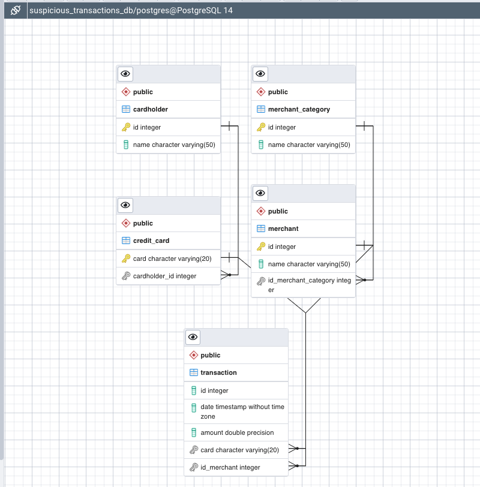
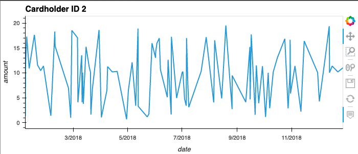
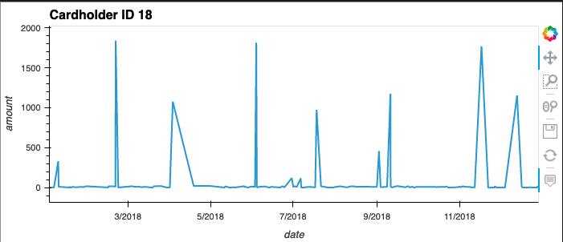
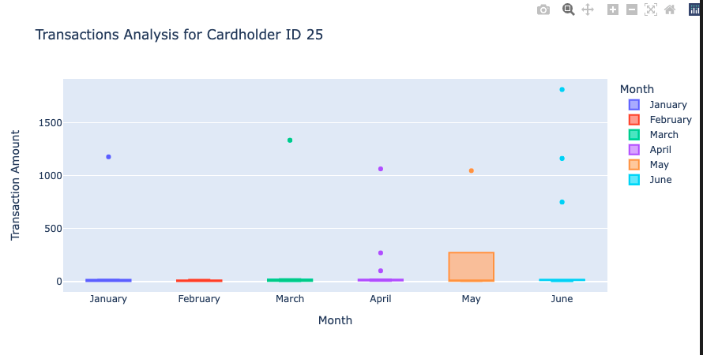

# Looking for Suspicious Transactions

*[Credit Card Fraudster by Richard Patterson](https://www.flickr.com/photos/136770128@N07/42252105582/) | [Creative Commons Licensed](https://creativecommons.org/licenses/by/2.0/)*

## Background

Fraud is prevalent these days, whether you are a small taco shop or a large international business. While there are emerging technologies that employ machine learning and artificial intelligence to detect fraud, many instances of fraud detection still require strong data analytics to find abnormal charges.

In this project I will apply my SQL skills to analyze historical credit card transactions and consumption patterns in order to identify possible fraudulent transactions.

I have completed three main tasks:

1. [Data Modeling](#Data-Modeling):
Define a database model to store the credit card transactions data and create a new PostgreSQL database using your model.

2. [Data Engineering](#Data-Engineering): Create a database schema on PostgreSQL and populate the database from the CSV files.

3. [Data Analysis](#Data-Analysis): Analyze the data to identify possible fraudulent transactions trends data, and develop a report of observations.

---

## Files

* [card_holder.csv](Data/card_holder.csv)
* [credit_card.csv](Data/credit_card.csv)
* [merchant.csv](Data/merchant.csv)
* [merchant_category.csv](Data/merchant_category.csv)
* [transaction.csv](Data/transaction.csv)

# Data Modelling and Data Engineering

To complete this project I first needed to complete an entity relationship diagram (ERD) and assign primary and foreign keys in order to determine the number of tables to create and what kind of relationships I need to define among the tables. [Quick Database Diagrams](https://www.quickdatabasediagrams.com) helped facilitate this process.

After using my database model as a blueprint, I created a database schema for each of my tables and relationships after specifying data types, primary keys, foreign keys and other constraints.

# Entity Relationship Diagram

# Data Analysis Observation Report

## Question #1

The two most important customers of the firm may have been hacked. Verify if there are any fraudulent transactions in their history. For privacy reasons, I only know that their cardholder IDs are 2 and 18.

Using hvPlot, I created a line plot representing the time series of transactions over the course of the year for each cardholder separately. 

Next, to better compare their patterns, I created a single line plot that contains both card holders' trend data.  

### What difference do you observe between the consumption patterns? Does the difference suggest a fraudulent transaction? Explain your rationale in the markdown report.

* Cardholder ID 2 transactions are never greater than $20. On the other hand, cardholder ID 18 regularly makes very small purchases and then there are significant spikes with high cost purchases almost as high as $2000. Since there are regular spikes in cardholder ID 18's transactions and regular small transactions, this suggests there might be some fraudulent activity occurring with this account and is worth validating with the cardholder. Small transactions can be a fraudsters way to check whether the account is still active before making larger fraudulent purchases. It is unlikely that there is any fraudulent activity with cardholder ID 2, since there are no outliers in the period observed.

## Question #2

The CEO of the biggest customer of the firm suspects that someone has used her corporate credit card without authorization in the first quarter of 2018 to pay quite expensive restaurant bills. Again, for privacy reasons, you know only that the cardholder ID in question is 25.

Using Plotly Express, I created a box plot, representing the expenditure data from January 2018 to June 2018 for cardholder ID 25.

### Are there any outliers for cardholder ID 25? How many outliers are there per month?

* Every month except for February contains outliers. January, March and May all have a single outlier, while April and June each have 3 outliers.

### Do you notice any anomalies? Describe your observations and conclusions in your markdown report.

* There are a total of 9 outlier transactions from January-June 2018 and thus each of these outliers are worth validating with the cardholder. It may be that there is fraudulent activity in both the 1st and 2nd quarters of 2018.